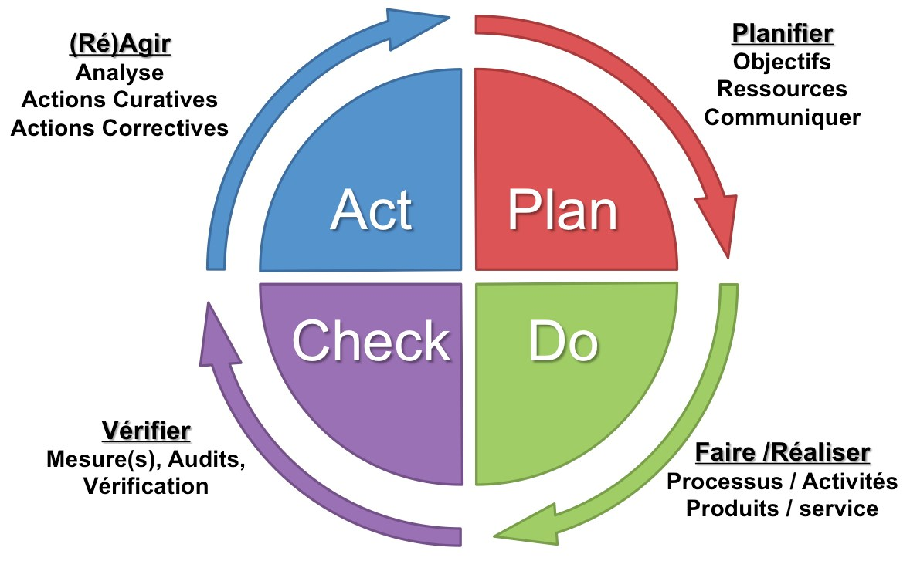
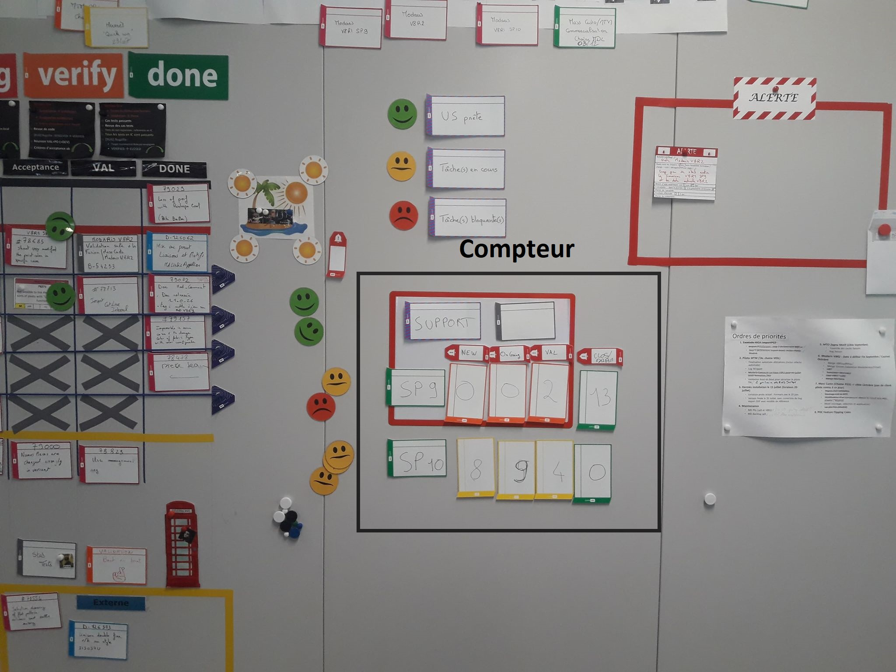
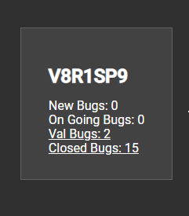
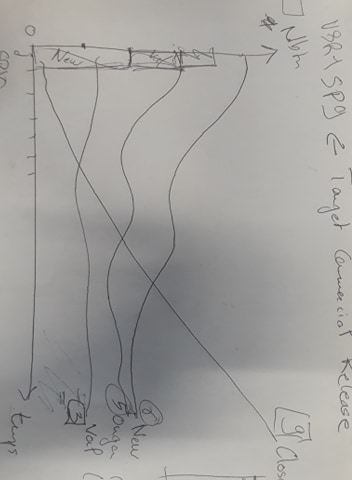
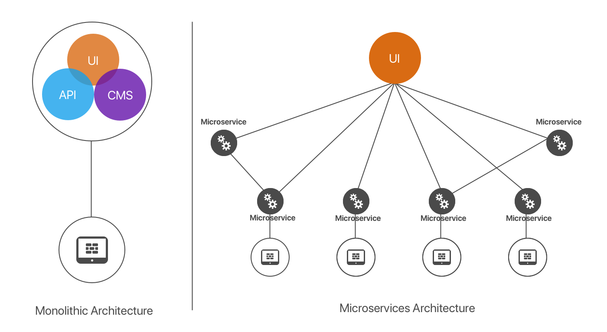

 # Rapport de stage
 
 Auteur: VERGNE Anthony  
 Maitre de stage: GUITTENY Fabrice  
 Tuteur: BLIN Guillaume
 
 18 Juin - 31 Août 2018
 
 - [Rapport de stage](#rapport-de-stage)
   - [I- Présentation](#i--pr%C3%A9sentation)
     - [1. L'entreprise](#1-lentreprise)
     - [2. L'environement](#2-lenvironement)
     - [3. L'équipe](#3-l%C3%A9quipe)
     - [4. Le sujet](#4-le-sujet)
   - [II- Réalisation de l'application](#ii--r%C3%A9alisation-de-lapplication)
     - [1- Développement](#1--d%C3%A9veloppement)
    - [2- Améliorations possibles](#2--am%C3%A9liorations-possibles)
    - [3- Technologies utilisées](#3--technologies-utilis%C3%A9es)
  - [III- Difficultés](#iii--difficult%C3%A9s)
  - [IV- Ce que j’ai appris](#iv--ce-que-jai-appris)
  - [IV- Ce que j’ai appris](#iv--ce-que-j%E2%80%99ai-appris)
  - [V- Remerciements](#v--remerciements)

Tout ce qui sui ne sont que commentaires et suggestions, tu prends ce que tu juge pertinent :)

## I- Présentation

### 1. L'entreprise

sur cette partie il faut seulement être vigillant à ne pas faire trop "plaquette commerciale"

 _Lectra_ est le numéro un mondial des solutions technologiques intégrées - logiciels, équipements de CFAO et services associés - dédiées aux entreprises qui utilisent des tissus, du cuir, des textiles techniques et des matériaux composites dans la fabrication de leurs produits. Elle s’adresse à de grands marchés mondiaux : la mode, l’automobile, l’ameublement, ainsi qu’à une grande variété d’autres industries (l’aéronautique, l’industrie nautique, l’éolien).

la phrase ci-dessous notamment, cf les mots en gras 
Entreprise transnationale basée à Cestas, _Lectra apporte ...

Entreprise transnationale **forte** _Lectra_ apporte des solutions métiers spécifiques à chaque industrie qui permettent d’automatiser et d’optimiser la création, le développement des produits et leur production. Dans la mode, elles sont intégrées dans une offre **sans équivalent** pour la gestion des collections, facilitant la collaboration et valorisant le capital créatif des marques.

Dans la mode, elles sont intégrées dans une offre de gestion des collections

Quelques chiffres illustrant l'importance de l'entreprise:  

Depuis sa création en 1973, _Lectra_ n’a cessé d’innover pour assurer à ses clients un accompagnement à long terme sans faille.

Pour répondre aux demandes changeantes du marché et renforcer leur compétitivité, les clients de _Lectra_ entreprennent des déploiements technologiques d’envergure et mettent en place des organisations plus collaboratives, agiles et efficaces, qu’ils savent indispensables à leur mutation industrielle. **Pionnière de l’Internet industriel des objets dès 2007, _Lectra_ est le seul acteur de son secteur à proposer une offre complète à forte valeur ajoutée essentielle au déploiement de _l’Industrie 4.0_.**

Pour les même raisons, j'eneleverai complètmeent cett phrase

_Lectra_ combinera progressivement, dès 2017, Software as a Service (SaaS) et cloud pour offrir à ses clients la flexibilité qui les aidera à tirer parti des solutions et services intelligents et à se doter d’outils de production compatibles avec les concepts de l’usine connectée.

Aujourd’hui, _Lectra_ compte plus de 23 000 clients dans plus de 100 pays et propose toute une gamme de logiciels, équipements de CFAO et services dédiés couvrant toute la chaîne de production d’un vêtement, de son design jusqu’à sa fabrication et sa distribution. Son offre s’étend à divers marchés mondiaux qu’on peut organiser en six grands marchés sectoriels : la mode et l’habillement, la chaussure, l’ameublement, la bagagerie, l’automobile, l’aéronautique.

_Lectra_ regroupe les plus grandes marques de mode, d’automobile et d’aéronautique. Voici un échantillon des grands groupes concernés : _Arena_, _Yves Saint Laurent_, _Renault_, _H&M_, _BMW_, _Mango_, _Armani_, _Diesel_, _Citroën_, _Airbus_, _Louis Vuiton_, ...

Aperçu des activités de _Lectra_:  

### 2. L'environement

Le cycle de production est constitué principalement de trois phases : la création, le développement et la production. L’offre de _Lectra_ couvre l’intégralité de ce processus car la société propose des solutions logicielles à chacune de ces étapes, du design à la production en passant par la phase de conception.

Le département recherche et développement software est donc découpé en plusieurs équipes réparties sur les différents projets de l'entreprise.

Ces équipes sont aussi encadrées par des managers et des coachs en agilité.

L'agilité (ou méthodes agiles) définit une approche de gestion de projet qui prend le contre-pied des approches traditionnelles prédictives et séquentielles de type cycle en V ou waterfall (en cascade). La notion même de "gestion de projet" est remise en question au profit de "gestion de produit", de façon à raisonner davantage "produit" que "projet".  
L’agilité est aussi la capacité d’une organisation à créer de la valeur et à ravir son client, tout en favorisant et en s’adaptant -à temps- aux changements de son environnement.

Un des principes du développement agile est de garantir des cycles brefs de développement en imposant une date de livraison fixe, ce qui permet d’obtenir un feedback rapide, optimisant ainsi en permanence la valeur des logiciels pour les clients et leur garantissant que les logiciels leur parviendront à la date prévue.

La méthode scrum utilisée ici relève d’une démarche d’amélioration continue.  
Chaque sprint (2 semaines) se termine par une démo du travail réalisé pendant le sprint ainsi que d'une rétrospective destinée à identifier les points d’amélioration et les actions à mettre en œuvre lors du sprint suivant.
Ont lieu également chaques matins des stand-up meetings afin de faire le point sur les nouvelles contraintes et sur l'avancement réalisé la journée précedante.

### 3. L'équipe

Lors de ce stage j'ai intégré l'équipe **Team Burton** qui fait partie des équipes CAD de _Lectra_. Mon équipe est composé de 9 membres (6 développeurs, 2 valideurs et un ProductOwner - chargé de la définition du produit) qui ont pour charge d'améliorer et maintenir **Modaris** et font partie intégrante des macros projets orientés Cloud qui sont en cours d'élaboration.

- **Modaris** est l’un des logiciels central de _Lectra_, il permet de concevoir des patrons 2D, de les grader et de les industrialiser en vue de leur placmeent puis découpe sur les machines vendues par la société. C'est le leader mondial des solutions de patronage. Il a été créé pour répondre parfaitement aux exigences de productivité ainsi qu’au type d’activité et au niveau de compétence des utilisateurs.

  Son environnement présente des outils de patronage traditionnels permettant de générer des patrons plus rapidement : la création de patrons totalement nouveaux ou à partir de patrons existants, la gradation en reproduisant des méthodes traditionnelles ou avancées, la vérification au moyen de techniques de pointe, les tâches d’industrialisation et de pré-production réalisées au début du processus de développement pour un gain de temps considérable.

  **Modaris** contribue à réduire considérablement le nombre de vérifications et d’ajustages successifs. Il permet également de voir le "fini" du vêtement en 3D sur un mannequin, les collisions du tissu avec lui même mais aussi avec le corps sont prises en compte. Le vêtement est également sujet à la gravité et autres forces liées à la structure du tissu (étirements, courbure et cisaillement) : si un pantalon est trop grand pour le mannequin il tombera à ses pieds.

  

       A gauche le patron du vêtement, à droite le rendu sur un mannequin avec la taille de base.
      On voit que cette taille est un peu petite pour le mannequin, des trous se forment au niveau de la poitrine. Il faudrait tester avec la taille supérieure ou réajuster la taille de base.

  

      Exemple d’une jupe trop grande. Il faudrait grader le vêtement pour qu’il convienne au mannequin.

### 4. Le sujet

**Problèmatique**:

    Dans un cadre agile, l'équipe est confronté à des taches répétitives et chronophages liées au suivi de leurs activités, par exemple tenir à jour un tableau répertoriant le nombre de bugs en cours ou l'état d'une tâche.

    Ainsi, dans le cadre de ma mission, j'ai eu pour objectif d'offrir à l'équipe des outils sur mesure qui auront pour but d'améliorer le travail de l'équipe.

_Lectra_ offre depuis peu à toute ses équipes des écrans de monitorings. Ainsi mon équipe a décidé d'automatiser un certain nombre de tâches récurentes. Mon objectif est donc de proposer et de réaliser différent affichages sur ces écrans. J'aurai donc à réaliser un certain nombre de graphiques, compteurs et APIs.  
Ces futurs éléments visuels et intuitifs permettront d'avoir un aperçu rapide des activités et de leur évolution.  
Ces outils leur feront gagner un temps précieux et leur permettront de se concentrer sur leurs activités principales afin de répondre plus rapidement à la demande du client ou de proposer de nouvelles fonctionnalités. Ils seront également une aide importante pour les prises de décisions concernant la priorité des corrections à mettre en oeuvre.

Pour moi ce stage est l'occasion d'acquérir des compétences en développement web, plus particulièrement en Javascript, mais aussi de découvrir ou d'approfondir certains concepts plus généraux de l'informatique.  
Ce stage étant mon premier dans ce domaine, il me permet également de découvrir la vie et le travail en entreprise au sein d'une équipe de développeurs expérimentés.

## II- Réalisation de l'application

### 1- Développement

<!-- **Activités parallèles**

- Readme
- Démos, AIC, débriefs en // -->

En arrivant dans l'entreprise, mon maître de stage m'a fait visité le batiment R&D Soft et expliqué le fonctionnement général de l'entreprise. Nous avons ensuite visité les autres batiments présents sur le site et réglé les dernier détails administratifs.

Aillant intégré une équipe dont une des composante essentielle est l'amélioration continue, ce stage se déroule en suivant ce même principe :

**Plan - Expression de besoin initiale**

L'objectif étant de réaliser une application web, le stage démarre par l'apprentissage de certaines technologies que j'utiliserai par la suite ([voir II.3 - technologies utilisées](#3--technologies-utilis%C3%A9es))

**Do - Autoformation**

La première étape a été d'être capable de dessiner un graphique très simple à l'aide des technologies apprises lors de ma formation

**Check - Premier graph**

On a obtenu un graphique en barres avec des valeurs arbitraires.

**Act- Base de travail**

Ce graphique n'est pas exploitable en l'état mais pourra servir de base pour la suite.

**Plan - Analyse des points d'amélioration**

Nous avons ensuite organisé une réunion avec une partie de l'équipe pour traiter l'expression de besoin concernant le dashboard. L'équipe voulait automatiser et améliorer des graphiques qui étaient fait sur _Excel_ et ou l'historisation était manuelle.

La modification des couleurs afin d'augmenter le contraste et d'incorporer le nouveau branding _Lectra_ était aussi un point d'amélioration évoqué.

**Do - Graphique Lead Time**

Il a donc été question de réaliser une ébauche des graphiques que l'on veux faire apparaitre sur l'application, toujours en s'appuyant sur des données statiques mais ressemblant à celles existantes dans la base de données :

**Check - Ébauche prête**

Cette première ébauche, bien que basée sur des données statiques est proche du résultat attendu.

**Act - Modifications et corrections**

Après présentation de mon travail à l'équipe et prise en compte des retours, j'ai pu apporter quelques améliorations et relier le graphique à la base de données.

L'image suivante montre le résultat final du premier graphique présent sur le Dashboard :

- Ce graphique montre le temps passé sur chaque bug.  
  Ce temps est divisé en 3 étapes : d'abord la prise en charge puis la correction et enfin la validation qui correspondent à des status présents sur _Bugzilla_.

- Cela a necessité la création d'une **API** pour récupérer les données sur le serveur Bugzilla.  
  Le nombre de jours ouvrés est ensuite calculé à partir de la date de modification des status puis ces données sont formatées et passées au composant Graphique via notre **HOC** (voir [II.3](#3--technologies-utilis%C3%A9es)).

- Certaines fonctionnalités ont également été ajouté par rapport au graphique disponible sur _Excel_ :

  - Lorsque l'on clique sur l'un des bugs présents sur le graphique, une vignette s'ouvre sur la droite de la page et indique plus d'informations concernant ce bug. On y retrouve la version ciblée pour cette correction, la criticité du bug, le temps total passé dessus ainsi qu'un lien direct vers la page Bugzilla de ce bug.

  - L'ajout d'une légende a également été effectué par rapport à la première version du graphique. En plus de donner des informations concernant l'affichage du graphique, cette légende apporte une interraction avec l'utilisateur. En effet cocher ou décocher un element de la légende permet de l'afficher ou de le masquer du rendu à l'écran comme ci-dessous :

    

**Plan - Inclure le graph dans l'application**

Une application de monitoring Next.js était déjà existante dans l'entreprise et utilisée par certaines équipes. Le prochain objectif a donc été d'inclure notre composant dans cette application.

**Do - Transformation du composant et modification du serveur**

Pour ce faire il a d'abord fallu transformer notre graphique en composant React et implémenter une API Bugzilla afin que le server puisse gerer nos requêtes.

**Check - État du serveur et du graphique**

    Avant modification du serveur, le navigateur l'interrogait avec une URL et la page correspondante était chargée.

    Après modification du serveur, si le navigateur demande une page comme celles qui existaient précédemment, le fonctionnement reste le même.

Cependant le nouveau serveur offre la possibilité d'avoir recours à des API. Si l'URL demandée correspond à celle d'une API le serveur va envoyer une requète et renvoyer le résultat.  
Un système de cache a également été mis en place afin d'améliorer les performances en cas de nombreux composants impliquants de nombreuses requêtes similaires.

    Ce fonctionnement est notamment le cas de l'affichage du premier graphique. Notre composant contenant l'URL de l'API, pour charger notre page, le navigateur interroge le serveur qui lui retourne la page après avoir récuperer les informations dans la base de donnée et dessiné le graphique.

**Act - Modifications et améliorations**

Une fois le graph fonctionnel, j'ai pu de nouveau collecter les retours de l'équipe et proceder aux modifications nécessaires puis passer au deuxième composant.

**Plan - Compteur Bugzilla**

Le deuxieme objectif été d'améliorer et d'automatiser un compteur de bugs mis à jour par l'équipe tous les matins lors du daily scum ou stand-up meeting color:yellow (AIC - Animation Interval court est un terme purmement Lectra).

**Do - Réalisation**

    Ici nous pouvons voir le compteur qui était mis à jour à la main en se connectant sur Bugzilla et en reportant le nombre de bugs. Cette opération, en plus d'être fastidieuse ne permet pas de faire un réel suivi de l'évolution du nombre de bugs puisqu'il n'y a pas d'historisation. 

Après avoir récupéré les données via notre API et une nouvelle requête SQL, nous pouvons afficher un compteur basique sur notre page.

**Check - État du compteur**

Ce nouveau compteur est simplement un composant React qui affiche les données recueillies en face de chaque état.

**Act - Amélioration du compteur**

A partir de ces compteurs, l'équipe a demandé à pouvoir visualiser la tendance de l'évolution de ces compteurs en tenant un historique.

**Plan - Historique du compteur**

Après avoir discuté avec certains membres de l'équipe, nous avons choisi de visualiser cet historique sous forme de graphique.

**Do - Réalisation du Cron et du graphique**

Le but étant cette fois-ci d'avoir un aperçu de la tendance du nombre de bugs, j'ai d'abord essayé de dessiner un graphique avec des lignes mais j'ai finalement opté pour des barres sans espaces entre elles afin de conservé l'affichage du nombre sur les rectangles. Ces expérimentations ont tout de même permis d'améliorer le composant afin de pouvoir dessiner plusieurs types de graphiques (ligne en pointillé, ligne normale, ligne qui rempli l'aire en dessous, barres avec plus ou moins d'espace) et donc qu'il soit réutilisable.

Le serveur a de nouveau été modifié afin d'offrir la possibilité d'ajouter des taches automatisées à un Cron.
La tache qu'exécute le cron actuellement est d'interroger la base de donnée tous les jours à une heure fixe et d'enregistrer le résultat reçu dans un fichier localement. Ce fichier est ensuite utilisé par le serveur afin de dessiner les graphiques retraçant l'historique des compteurs :

**Check - État du serveur et du composant**

Ce graphique est donc dessiné à partir des données sauvegardés sur la machine par le Cron.
Comme sur notre premier graphique il est possible de selectionner une colonne pour cette fois çi afficher le compteur du jour correspondant à cette colonne.

Des liens sont également disponibles sur le compteur pour acceder à la liste des bugs correspond à l'état ciblé sur Bugzilla.

**Act - Modifications et corrections**

Ajout de la possibilité de survoler la date sur le compteur afin de faire apparaitre le jour de la semaine correspondant ainsi que de survoler le titre pour faire apparaitre plus de détails (Modaris comprend enfait plusieurs produits).

**Plan - Installer l'application**

La fin de mon stage étant proche, je consacre les derniers jours de celui-ci a installer l'application sur les écrans de monitoring.

**Do - Installation**

Clonnage du répertoire, ajout d'un ficher .env qui offre certains paramètrages à l'utilisateur et qui contient les credentials de la base de donnée, création d'un service windows afin que l'application se lance automatiquement au démarrage de l'écran et implémentation de la navigation au clavier (évenement clavier lié à l'évenement "clique sur la flèche du carousel").

**Check - Dernières vérifications**

Je profite de mes derniers moments de libre afin d'apporter les dernières modifications.

**Act - Fin du stage**

Mon stage touche à sa fin et je n'ai malheureusement plus le temps de développer de nouveaux composants.

**Plan - Démonstration en amphi**

Nous terminerons par une démonstration du résultat de mon travail à l'ensemble des équipes de la R&D Soft.

**Do - Présentation**

Préparation d'un diaporama (voir Présentation.pptx) et des différents points à aborder lors de ma présentation puis mise en place dans l'amphithéatre.

**Check - Derniers point**

Cette présentation a eu pour effet d'amener de nouveaux retours et points d'améliorations qui pourront être traités par l'équipe après mon départ.

### 2- Améliorations possibles

Nouveaux composants :

- Creer d'autres graphiques concernant le support et la maintenance de Modaris (nombre d'appels au call-center, volumétrie des tâches, évolution des bugs découpée pour chaque produit), etc.
- Ajout d'un composant **Jenkins** pour suivre les logs, ce composant était présent sur l'ancienne application de monitoring.

Améliorations :

- Avoir une réglette pour selectionner la période d'affichage des graph compteurs (déjà parametrable dans le fichier .env).
- La fonction dateDiffInDays (formatLTGraphData.js) devrait calculer les jours ouvrés entre deux dates mais elle ne prend pas encore en compte les jour fériés.
- Séparer complétement les API et le rendu.
- Inverser la couleur des points du carousel pour un rendu plus intuitif.

### 3- Technologies utilisées

Sur la partie technique je laisse Guillaume faire les commentaires, il seront bien plus pertinents que les miens ;)

Le but étant de créer une application web, les langages informatiques incontournables dont nous avons besoin sont **HTML**, **CSS** et **JavaScript**, ces langages sont aujourd'hui à la base de tous les sites web :

- **HTML (HyperText Markup Language)** a fait son apparition dès 1991 lors du lancement du Web, son rôle est de gérer et organiser le contenu de la page à l'aide de balises.

- **CSS (Cascading Style Sheets ou Feuilles de style)** quant à lui a pour rôle de gérer l'apparence de la page web (agencement, positionnement, décoration, couleurs, taille du texte…). Ce langage est venu compléter le **HTML** en 1996.

- **JavaScript** est un langage scripté conçu pour rendre les pages web interactives.  
  C'est un langage orienté objet à prototype, c'est-à-dire que les bases du langage et ses principales interfaces sont fournies par des objets qui ne sont pas des instances de classes, mais qui sont chacun équipés de constructeurs permettant de créer leurs propriétés, et notamment une propriété de prototypage qui permet d'en créer des objets héritiers personnalisés. En outre, les fonctions sont des objets de première classe.  
  Le langage supporte donc le paradigme _objet_, _impératif_ et _fonctionnel_. **JavaScript** est également le langage possédant le plus large écosystème grâce à son gestionnaire de dépendances npm, avec environs 500 000 paquets en août 2017.

L'application de monitoring déjà en place dans l'entreprise est construite à partir de composants **React.js** délivrés par un serveur **Node.js** et **Next.js**:

- **React.js** est une bibliothèque **JavaScript** libre développée par _Facebook_ depuis 2013. Le but principal de cette bibliothèque est de faciliter la création d'application web monopage, via la création de composants dépendant d'un état et générant une page (ou portion) **HTML** à chaque changement d'état.  
  Elle ne gère que l'interface de l'application, considéré comme la vue dans le **modèle MVC**. La bibliothèque se démarque de ses concurrents par sa flexibilité et ses performances, en travaillant avec un **DOM virtuel** et en ne mettant à jour le rendu dans le navigateur qu'en cas de nécessité.  
  Cette bibliothèque est utilisée notamment par _Netflix_, _Yahoo_, _Airbnb_, _Sony_, _Atlassian_, _Facebook_, _Instagram_ ou encore _WhatsApp_.

- **Node.js** est une plateforme logicielle libre et événementielle. Cette plateforme est orientée vers les applications réseau qui doivent pouvoir monter en charge.  
  Créé par _Ryan Dahl_ en 2009, **Node.js** est un environnement bas niveau permettant l’exécution de **JavaScript** côté serveur.

- **Next.js** permet d’effectuer le rendu des applications **React** par les serveurs.  
  Il permet aussi d'effectuer un routage côté client qui se présente comme les applications universelles natives.  
   **Next.js** est développé par ZEIT et bâti sur **React**, **Webpack** et **Babel**

Les graphiques réalisés rendent comptes de données du logiciel **Bugzilla** présentes sur un serveur **MySQL**. Elles sont extraites à l'aide d'une **API** créée pour l'occasion et passée à notre composant à travers un **HOC**.  
Ces graphiques utilisent le format de dessin **SVG** qui, de part sa nature vectorielle, offre la possibilité de zoomer ou de dézoomer à l'infini sans jamais déformer l'image. L'utilisation de ce format est rendu possible dans notre application par l'utilisation de la bibliothèque graphique **D3.js**.  
Le deuxieme graph nécessite également le stockage de l'historique de la liste des bugs. Cet historique est stocké sous forme de fichiers **JSON** afin d'être réutilisable facilement dans le code **Javascript**

- **Bugzilla** est un logiciel libre de système de suivi de problèmes avec interface web.  
  Développé et utilisé par l'organisation _Mozilla_, ce logiciel gère le suivi de bugs (ou de « demandes d'améliorations ») provenant de sites, logiciels et courriels sous la forme de « tickets ».  
  Les bugs sont classés en fonction de leur étape d'étude (arrivée, bug non confirmé, prise en compte bug, bug confirmé, en cours d'étude, résolu, solution insatisfaisante, solution satisfaisante).

- **MySQL** est un serveur de bases de données relationnelles **SQL** développé dans un souci de performances élevées en lecture, ce qui signifie qu'il est davantage orienté vers le service de données déjà en place que vers celui de mises à jour fréquentes et fortement sécurisées. Il est multi-thread et multi-utilisateur.  
  C'est un logiciel libre et open source, développé sous double licence selon qu'il est distribué avec un produit libre ou avec un produit propriétaire.

- Une **API** (ou interface de programmation applicative ) est un ensemble normalisé de classes, de méthodes ou de fonctions qui sert de façade par laquelle un logiciel offre des services à d'autres logiciels.

- Un **HOC (=Higher Order Component)** est une fonction qui prend en paramètre une définition de composant (classe ou fonction), et renvoie une nouvelle définition de composant, qui ajoute du comportement à la première. Il s’agit en fait du pattern Décorateur (ou Higher Order Function) appliqué aux composants React.

- **SVG (=Scalable Vector Graphics)** est un format de données conçu pour décrire des ensembles de graphiques vectoriels et basé sur **XML**. Ce format, spécifié par le _World Wide Web Consortium_, est inspiré directement du **VML** et du **PGML**

- **D3.js** permet l'affichage de données numériques sous une forme graphique et dynamique.  
  Il s'agit d'un outil important pour la conformation aux normes **W3C** qui utilise les technologies courantes **SVG**, **JavaScript** et **CSS** pour la visualisation de données. **D3** est le successeur officiel du précédent framework **Protovis**. Contrairement aux autres bibliothèques, celle-ci permet un plus ample contrôle du résultat visuel final.

- **JSON (JavaScript Object Notation)** est format de données textuelles dérivé de la notation des objets du langage **JavaScript** créé par _Douglas Crockford_ entre 2002 et 2005 et décrit par la _RFC 7159_ de _l’IETF_.  
  Un document **.json** a pour fonction de représenter de l'information accompagnée d'étiquettes permettant d'en interpréter les divers éléments, sans aucune restriction sur le nombre de celles-ci, il permet de représenter de l’information structurée comme le permet **XML** par exemple.

Le projet de dashboards se trouve sur un dépot **GitLab** qui permet de faciliter la gestion et la relecture du code source. Bien que chaque équipe possède sa propre page de métriques, le serveur et certains composants sont mis en communs avec les autres.

- **GitLab** est un gestionnaire de référentiels **Git** basé sur le Web, doté de fonctionnalités de pipeline wiki, de suivi des problèmes et de CI / CD, utilisant une licence open source, développée par _GitLab Inc_.

- **Git** est un logiciel de gestion de version décentralisé.  
  Ce logiciel libre créé par _Linus Torvalds_, auteur du noyau **Linux**, et distribué selon les termes de la licence publique générale _GNU version 2_, est le logiciel de gestion de versions le plus populaire, utilisé par plus de douze millions de personnes.

## III- Difficultés

- Apprentissage d'un nouveau langage et de nouvelles méthodes.
- Cibler les attentes de l'utilisateur.
- Structure du code HTML: le graphique était d'abord construit par état mais le construire par colonne permet de selectionner l'intégralité de la colonne plus facilement.
- Changer toute la colonne dans une même couleur n'était pas pertinent, passer au format de couleur HCL permet de modifier légérement la luminosité et de "tourner" la couleur de la colonne pour une animation plus discrete et naturelle.  
  
- Structure du projet (découpage en composants, APIs, services et pages).
- Le développement Back-end (server, API, base de donnée).
- Accessibilité et réutilisabilité des composants pour les autres équipes
- Formatage des dates
- Chiffrage / gestion du temps

## IV- Ce que j’ai appris
- Compétences de développement (langage JavaScript, node.js, react.js, d3.js, git, svg, .json, markdown)
- Monde de l’entreprise (méthodes agiles)
- Culture Informatique (web-assembly, cloud, scaling dynamique, intégration continue).
- Séparation collecte de data/formatage/rendu^.
- Animation.
- Architecture microservices (permet un scaling horizontal et de déployer, ajuster, puis redéployer indépendamment les différents services sans compromettre l'intégrité d'une application):
  

## V- Remerciements

Je tiens à remercier l'_université de Bordeaux_ ainsi que l'entreprise _Lectra_ pour m'avoir permit de réaliser ce stage, Magalie Soubré Emporio pour m'avoir aidé a le trouver, les équipes ArtCAD et Team Burton pour avoir été trés accueillantes, M Guillaume Blin et Fabrice Guitteny pour avoir encadré ce stage ainsi que Guillaume Sévaux pour m'avoir accompagné tout au long de celui-ci et pour m'avoir appris énormément de choses.

 
