# Rapport de stage

Auteur: VERGNE Anthony  
Maitre de stage: GUITTENY Fabrice  
Tuteur: BLIN Guillaume

18 Juin - 31 Août 2018

- [Rapport de stage](#rapport-de-stage)
  - [I- Présentation](#i--pr%C3%A9sentation)
    - [1. L'entreprise](#1-lentreprise)
    - [2. L'environement](#2-lenvironement)
    - [3. L'équipe](#3-l%C3%A9quipe)
    - [4. Le sujet](#4-le-sujet)
  - [II- Dashboard](#ii--dashboard)
    - [1- Expression de besoin](#1--expression-de-besoin)
    - [2- Résultat](#2--r%C3%A9sultat)
      - [A-Coté client](#a-cot%C3%A9-client)
      - [B-Coté serveur](#b-cot%C3%A9-serveur)
    - [3- Améliorations possibles](#3--am%C3%A9liorations-possibles)
    - [4- Technologies utilisées](#4--technologies-utilis%C3%A9es)
  - [III - Déroulement et activités](#iii---d%C3%A9roulement-et-activit%C3%A9s)
  - [IV- Difficultés](#iv--difficult%C3%A9s)
  - [V- Ce que j’ai appris](#v--ce-que-jai-appris)
  - [VI- Remerciements](#vi--remerciements)

## I- Présentation

### 1. L'entreprise

_Lectra_ est le numéro un mondial des solutions technologiques intégrées - logiciels, équipements de CFAO et services associés - dédiées aux entreprises qui utilisent des tissus, du cuir, des textiles techniques et des matériaux composites dans la fabrication de leurs produits. Elle s’adresse à de grands marchés mondiaux : la mode, l’automobile, l’ameublement, ainsi qu’à une grande variété d’autres industries (l’aéronautique, l’industrie nautique, l’éolien).

Entreprise transnationale forte _Lectra_ apporte des solutions métiers spécifiques à chaque industrie qui permettent d’automatiser et d’optimiser la création, le développement des produits et leur production. Dans la mode, elles sont intégrées dans une offre sans équivalent pour la gestion des collections, facilitant la collaboration et valorisant le capital créatif des marques.

Quelques chiffres illustrant l'importance de l'entreprise:  
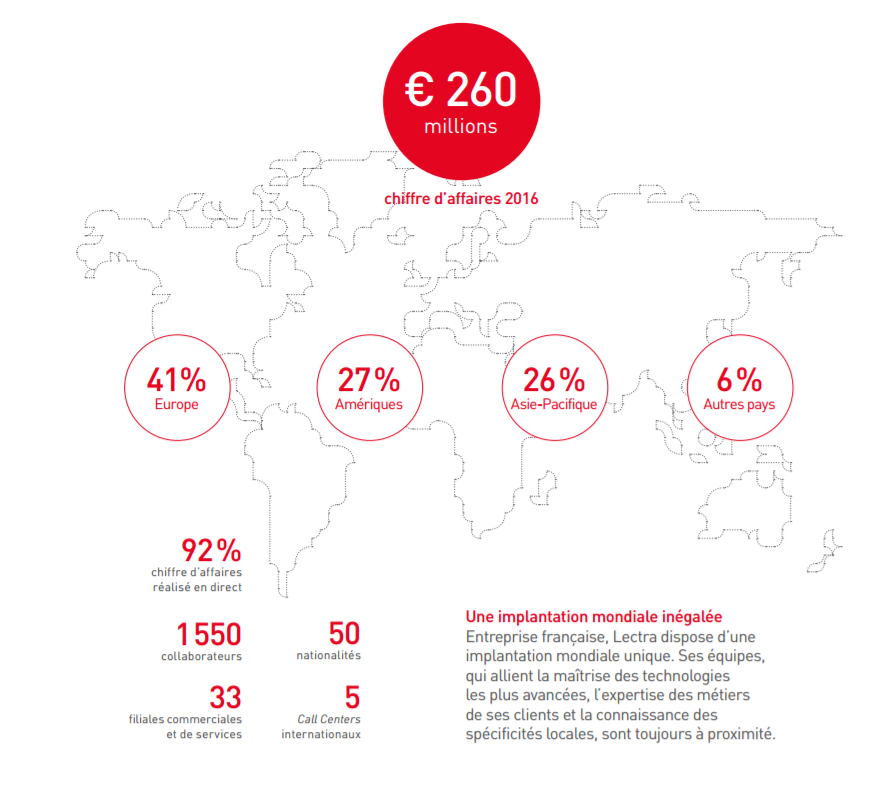

Depuis sa création en 1973, _Lectra_ n’a cessé d’innover pour assurer à ses clients un accompagnement à long terme sans faille.

Pour répondre aux demandes changeantes du marché et renforcer leur compétitivité, les clients de _Lectra_ entreprennent des déploiements technologiques d’envergure et mettent en place des organisations plus collaboratives, agiles et efficaces, qu’ils savent indispensables à leur mutation industrielle. Pionnière de l’Internet industriel des objets dès 2007, _Lectra_ est le seul acteur de son secteur à proposer une offre complète à forte valeur ajoutée essentielle au déploiement de _l’Industrie 4.0_.

_Lectra_ combinera progressivement, dès 2017, Software as a Service (SaaS) et cloud pour offrir à ses clients la flexibilité qui les aidera à tirer parti des solutions et services intelligents et à se doter d’outils de production compatibles avec les concepts de l’usine connectée.

Aujourd’hui, _Lectra_ compte plus de 23 000 clients dans plus de 100 pays et propose toute une gamme de logiciels, équipements de CFAO et services dédiés couvrant toute la chaîne de production d’un vêtement, de son design jusqu’à sa fabrication et sa distribution. Son offre s’étend à divers marchés mondiaux qu’on peut organiser en six grands marchés sectoriels : la mode et l’habillement, la chaussure, l’ameublement, la bagagerie, l’automobile, l’aéronautique.

_Lectra_ regroupe les plus grandes marques de mode, d’automobile et d’aéronautique. Voici un échantillon des grands groupes concernés : _Arena_, _Yves Saint Laurent_, _Renault_, _H&M_, _BMW_, _Mango_, _Armani_, _Diesel_, _Citroën_, _Airbus_, _Louis Vuiton_, ...

Aperçu des activités de _Lectra_:  
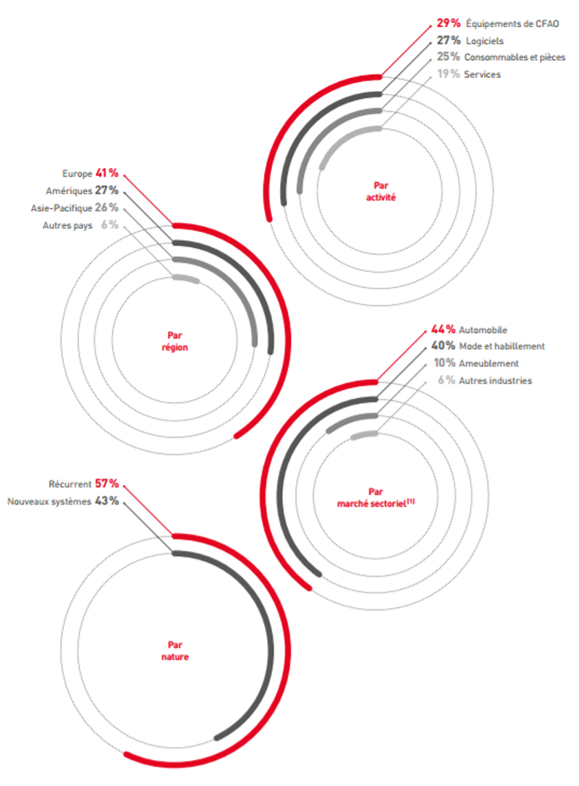

### 2. L'environement

Le cycle de production est constitué principalement de trois phases : la création, le développement et la production. L’offre de Lectra couvre l’intégralité de ce processus car la société propose des solutions logicielles à chacune de ces étapes, du design à la production en passant par la phase de conception.

[todo: chiffres R&D]  
Le département recherche et développement software est donc découpé en plusieurs équipes réparties sur les différents projets de l'entreprise.

Ces équipes sont aussi encadrés par des managers et des coach en agilité.

L'agilé (ou méthodes agiles) définit une approche de gestion de projet qui prend le contre-pied des approches traditionnelles prédictives et séquentielles de type cycle en V ou waterfall (en cascade). La notion même de "gestion de projet" est remise en question au profit de "gestion de produit", de façon à raisonner davantage "produit" que "projet".  
L’agilité est aussi la capacité d’une organisation à créer de la valeur et à ravir son client, tout en favorisant et en s’adaptant -à temps- aux changements de son environnement.

Un des principes du développement agile est de garantir des cycles brefs de développement en imposant une date de livraison fixe, ce qui permet d’obtenir un feedback rapide, optimisant ainsi en permanence la valeur des logiciels pour les clients et leur garantissant que les logiciels leur parviendront à la date prévue.

La méthode scrum utilisée ici relève d’une démarche d’amélioration continue.  
Chaque sprint (2 semaines) se termine par une rétrospective destinée à identifier les points d’amélioration et les actions à mettre en œuvre lors du sprint suivant.  
Ont lieu également chaques matins des stand-up meetings afin de faire le point sur les nouvelles contraintes et sur l'avancement réalisé la journée précedante.

### 3. L'équipe

Lors de ce stage j'ai intégré l'équipe **Team Burton** qui fait partie des équipes CAD de **Lectra**. Mon équipe est composé de 9 membres qui ont pour charge d'améliorer et maintenir **Modaris**

- **Modaris** est l’un des logiciels central de Lectra, il permet de concevoir des patrons 2D et de programmer les machines de découpes vendues par la société, c'est le leader mondial des solutions de patronage. Il a été créé pour répondre parfaitement aux exigences de productivité ainsi qu’au type d’activité et au niveau de compétence des utilisateurs.

  Son environnement présente des outils de patronage traditionnels permettant de générer des patrons plus rapidement : la création de patrons totalement nouveaux ou à partir de patrons existants, la gradation en reproduisant des méthodes traditionnelles ou avancées, la vérification au moyen de techniques de pointe, les tâches d’industrialisation et de pré-production réalisées au début du processus de développement pour un gain de temps considérable.

  **Modaris** contribue à réduire considérablement le nombre de vérifications et d’ajustages successifs. Il permet également de voir le "fini" du vêtement en 3D sur un mannequin, les collisions du tissu avec lui même mais aussi avec le corps sont prises en compte. Le vêtement est également sujet à la gravité et autres forces liées à la structure du tissu (étirements, courbure et cisaillement) : si un pantalon est trop grand pour le mannequin il tombera à ses pieds.

  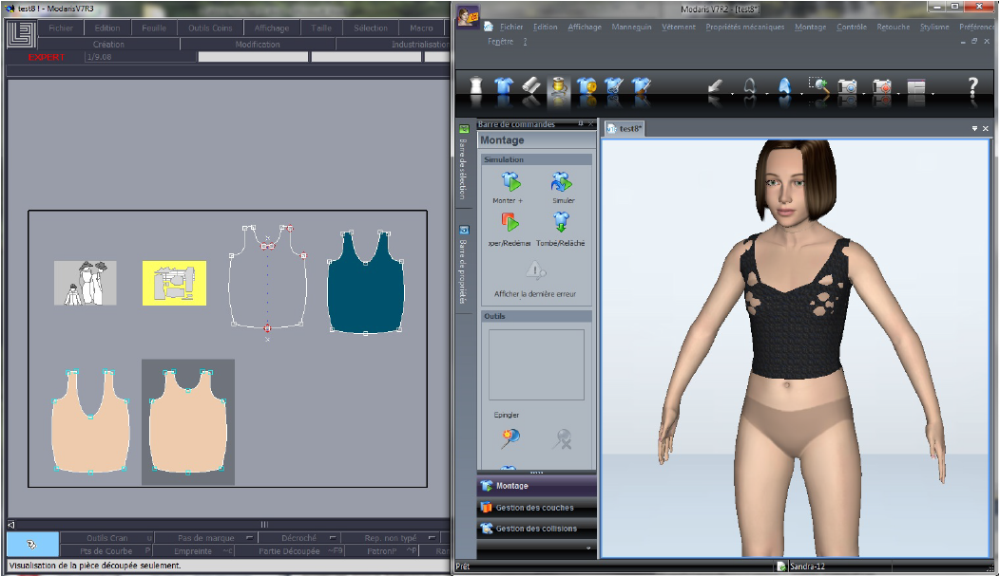

       A gauche le patron du vêtement, à droite le rendu sur un mannequin avec la taille de base.
      On voit que cette taille est un peu petite pour le mannequin, des trous se forment au niveau de la poitrine. Il faudrait tester avec la taille supérieure ou réajuster la taille de base.

  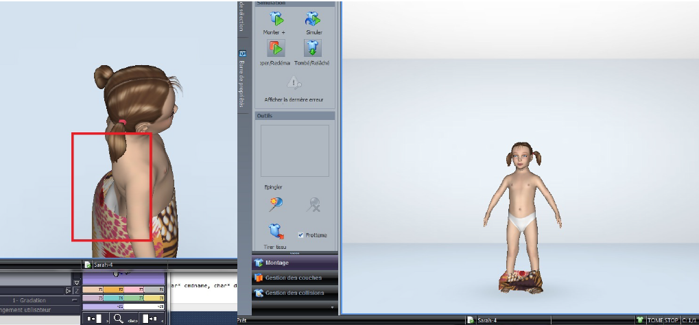

      Exemple d’une jupe trop grande. Il faudrait grader le vêtement pour qu’il convienne au mannequin.

### 4. Le sujet

**Problèmatique**:

    Dans un cadre agile, l'équipe est confronté à des taches répétitives et chronophages liées au suivi de leurs activités, par exemple tenir à jour un tableau répertoriant le nombre de bugs en cours ou l'état d'une tache.

    Ainsi, dans le cadre de ma mission, j'ai eu pour objectif d'offrir à l'équipe des outils sur mesure qui auront pour but d'améliorer le travail de l'équipe.

Lectra offre depuis peu à toute ses équipes des écrans de monitorings. Ainsi mon équipe a décidé d'automatisé un certain nombre de tache récurente. Mon objectif est donc de réalisé un sertain nombre d'affichage sur ces écrans. J'aurai donc des graphs, des compteurs, des pastilles, des api... à réaliser.
Ces futurs éléments colorées et intuitif premetrons d'avoir un aperçu rapide des activités et de leur évolution.  
Ces outils leur feront gagner un temps précieux et leur permettront de se concentrer sur leurs activités principales afin de répondre plus rapidement à la demande du client ou de proposer de nouvelles fonctionnalités.

Pour moi ce stage est l'occasion d'acquérir des compétences en développement web, plus particulièrement en Javascript, mais aussi de découvrir ou d'approfondir certains concepts plus généraux de l'informatique. Ce stage étant mon premier dans ce domaine, il me permet également de découvrir la vie et le travail en entreprise au sein d'une équipe de développeurs expérimentés.

## II- Dashboard

### 1- Expression de besoin

analyse points d'amélioration  
mail  
graphs excel valid  
couleurs plus contrastées + branding  
compteur bugs + graph historique  
croquis graph

### 2- Résultat

#### A-Coté client

La première étape a été d'être capable de dessiner un graphique très simple à l'aide des technologies apprises lors de mon auto-formation:  

La seconde étape a été de faire évoluer le graphique vers ce à quoi il devrait ressembler , toujours en s'appuyant sur des données statiques mais ressemblant à celles existantes dans la base de donnée:
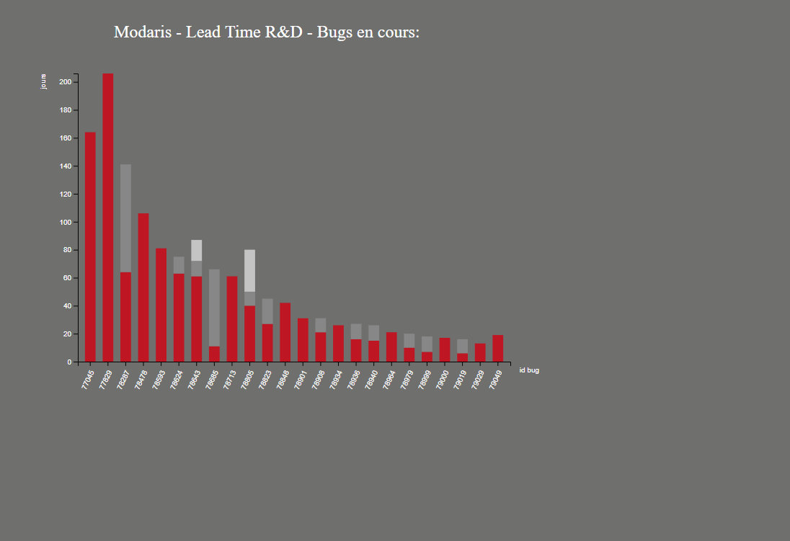

Après présentation du premier jet à l'équipe et prise en compte des retours, j'ai pu apporter quelques améliorations et relier le graphique à la base de donnée.

L'image suivante montre le résultat final du premier graphique présent sur le dashboard.

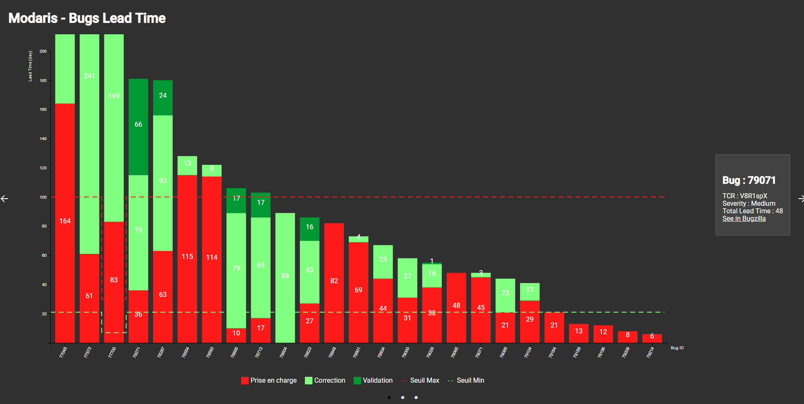

- Description graph lead time (utilité, source, ...)

  <!-- Ce graphique montre le temps passé sur chaque état des bugs -->

- Lorsque l'on clique sur l'un des bugs présents sur le graphique, un [écran/carré/... ?] s'ouvre sur la droite de la page et indique plus d'informations concernant ce bug. On y retrouve le TCR [todo: =la version commerciale ciblée pour correction], la criticité du bug, le temps total passé dessus ainsi qu'un lien direct vers la page Bugzilla de ce bug.

- L'ajout d'une légende a également été effectué par rapport à la première version du graphique. En plus de donner des informations concernant l'affichage du graphique, cette légende apporte une interraction avec l'utilisateur. En effet cocher ou décocher un element de la légende permet de l'afficher ou de le masquer du rendu à l'écran comme ci-dessous:

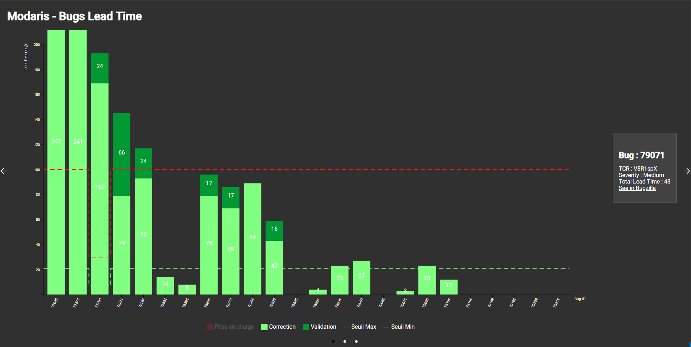

[croquis Fabrice]

[Graph filled lines]

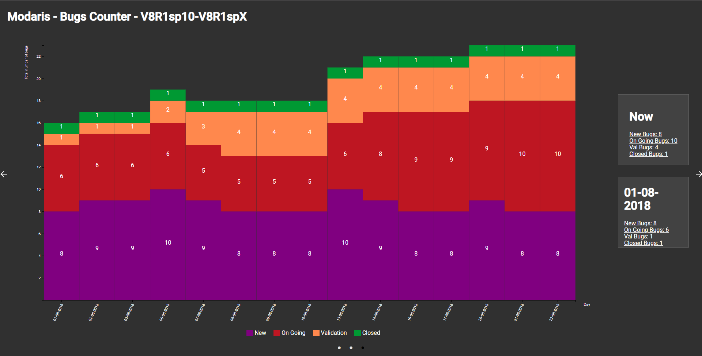
Le but étant cette fois-ci d'avoir un aperçu de la tendance du nombre de bugs, j'ai d'abord essayé de dessiner un graphique avec des lignes mais j'ai finalement opté pour des barres sans espaces entre elles afin de conservé l'affichage du nombre sur le rectangle. Ces expérimentations ont tout de même permis d'améliorer le composant afin de pouvoir dessiner plusieurs types de graphiques (ligne en pointillé, ligne normale, ligne qui rempli l'aire en dessous, barres avec plus ou moins d'espace) et donc qu'il soit réutilisable.

    - Description cron
    - Desctription historique
    - Description Affichage
    - Survol titre compteur

#### B-Coté serveur

La réalisation de ces graphiques a également nécessité la modification du fonctionnement du serveur:


    Avant modification du serveur, le navigateur l'interrogait avec une URL et la page correspondante était chargée.


    Après modification du serveur, si le navigateur demande une page comme celles qui existaient précédemment, le fonctionnement reste le même.

    Cependant le nouveau serveur offre la possibilité d'avoir recours à des API. Si l'URL demandée correspond à celle d'une API le serveur va envoyer une requète et renvoyer le résultat.


    Ce fonctionnement est notamment le cas de l'affichage du premier graphique. Notre composant contenant l'URL de l'API, pour charger notre page, le navigateur interroge le serveur qui lui retourne la page après avoir récuperer les informations dans la base de donnée et dessiné le graphique.


    Le nouveau serveur offre aussi la possibilité d'ajouter des taches automatisées à un Cron.
    La tache qu'exécute le cron actuellement est d'interroger la base de donnée tous les jours à une heure fixe et d'enregistrer le résultat reçu dans un fichier localement. Ce fichier est ensuite utilisé par le server afin de dessiner les graphiques retraçant l'historique des compteurs.

- .env
- cache
- Decoupage data / rendu

### 3- Améliorations possibles

Nouveaux composants :

- Creer d'autres graphs concernant le support et la maintenance de Modaris (nombre d'appels, volumétrie des taches, évolution des bugs découpée pour chaque [todo: feature ?])
- Ajout de composants de suivi de logs **Jenkins** présents sur l'ancienne application de monitoring.

Améliorations :

- Avoir une réglette pour selectionner la période d'affichage des graph compteurs (déjà parametrable dans le fichier .env).
- La fonction dateDiffInDays (formatLTGraphData.js) devrait calculé les jours ouvrés entre deux dates mais elle ne prend pas encore en compte les jour fériés.
- Séparer complétement les API et le rendu.
- Inverser la couleur des points du carousel

### 4- Technologies utilisées

Le but étant de créer une application web, les langages informatiques incontournables dont nous avons besoin sont **HTML**, **CSS** et **JavaScript**, ces langages sont aujourd'hui à la base de tous les sites web:

- **HTML (HyperText Markup Language)** a fait son apparition dès 1991 lors du lancement du Web, son rôle est de gérer et organiser le contenu de la page à l'aide de balises.

- **CSS (Cascading Style Sheets ou Feuilles de style)** quant à lui a pour rôle de gérer l'apparence de la page web (agencement, positionnement, décoration, couleurs, taille du texte…). Ce langage est venu compléter le **HTML** en 1996.

- **JavaScript** est un langage scripté conçu pour rendre les pages web interactives .  
  C'est un langage orienté objet à prototype, c'est-à-dire que les bases du langage et ses principales interfaces sont fournies par des objets qui ne sont pas des instances de classes, mais qui sont chacun équipés de constructeurs permettant de créer leurs propriétés, et notamment une propriété de prototypage qui permet d'en créer des objets héritiers personnalisés. En outre, les fonctions sont des objets de première classe.  
  Le langage supporte donc le paradigme _objet_, _impératif_ et _fonctionnel_. **JavaScript** est également le langage possédant le plus large écosystème grâce à son gestionnaire de dépendances npm, avec environs 500 000 paquets en août 2017.

L'application de monitoring déjà en place dans l'entreprise est construite à partir de composants **React.js** délivrés par un serveur **Node.js** et **Next.js**:

- **React.js** est une bibliothèque **JavaScript** libre développée par _Facebook_ depuis 2013. Le but principal de cette bibliothèque est de faciliter la création d'application web monopage, via la création de composants dépendant d'un état et générant une page (ou portion) **HTML** à chaque changement d'état.  
  Elle ne gère que l'interface de l'application, considéré comme la vue dans le **modèle MVC**. La bibliothèque se démarque de ses concurrents par sa flexibilité et ses performances, en travaillant avec un **DOM virtuel** et en ne mettant à jour le rendu dans le navigateur qu'en cas de nécessité.  
  Cette bibliothèque est utilisée notamment par _Netflix_, _Yahoo_, _Airbnb_, _Sony_, _Atlassian_, _Facebook_, _Instagram_ ou encore _WhatsApp_.

- **Node.js** est une plateforme logicielle libre et événementielle. Cette plateforme est orientée vers les applications réseau qui doivent pouvoir monter en charge.  
  Créé par _Ryan Dahl_ en 2009, **Node.js** est un environnement bas niveau permettant l’exécution de **JavaScript** côté serveur.

- **Next.js** permet d’effectuer le rendu des applications **React** par les serveurs.  
  Il permet aussi d'effectuer un routage côté client qui se présente comme les applications universelles natives.  
   **Next.js** est développé par ZEIT et bâti sur **React**, **Webpack** et **Babel**

Les graphiques réalisés rendent comptes de données du logiciel **Bugzilla** présentes sur un serveur **MySQL**.  
Ces graphiques utilisent le format de dessin **SVG** qui, de part sa nature vectorielle, offre la possibilité de zoomer ou de dézoomer à l'infini sans jamais déformer l'image. L'utilisation de ce format est rendu possible dans notre application par l'utilisation de la bibliothèque graphique **D3.js**.  
Le deuxieme graph nécessite également le stockage de l'historique de la liste des bugs. Cette historique est stocké sous forme de fichiers **JSON** afin d'être réutilisable facilement dans le code **Javascript**

- **Bugzilla** est un logiciel libre de système de suivi de problèmes avec interface web.  
  Développé et utilisé par l'organisation _Mozilla_, ce logiciel gère le suivi de bugs (ou de « demandes d'améliorations ») provenant de sites, logiciels et courriels sous la forme de « tickets ».  
  Les bugs sont classés en fonction de leur étape d'étude (arrivée, bug non confirmé, prise en compte bug, bug confirmé, en cours d'étude, résolu, solution insatisfaisante, solution satisfaisante).

- **MySQL** est un serveur de bases de données relationnelles **SQL** développé dans un souci de performances élevées en lecture, ce qui signifie qu'il est davantage orienté vers le service de données déjà en place que vers celui de mises à jour fréquentes et fortement sécurisées. Il est multi-thread et multi-utilisateur.  
  C'est un logiciel libre et open source, développé sous double licence selon qu'il est distribué avec un produit libre ou avec un produit propriétaire.

- **SVG (Scalable Vector Graphics)** est un format de données conçu pour décrire des ensembles de graphiques vectoriels et basé sur **XML**. Ce format, spécifié par le _World Wide Web Consortium_, est inspiré directement du **VML** et du **PGML**

- **D3.js** permet l'affichage de données numériques sous une forme graphique et dynamique.  
  Il s'agit d'un outil important pour la conformation aux normes **W3C** qui utilise les technologies courantes **SVG**, **JavaScript** et **CSS** pour la visualisation de données. **D3** est le successeur officiel du précédent framework **Protovis**. Contrairement aux autres bibliothèques, celle-ci permet un plus ample contrôle du résultat visuel final.

- **JSON (JavaScript Object Notation)** est format de données textuelles dérivé de la notation des objets du langage **JavaScript** créé par _Douglas Crockford_ entre 2002 et 2005 et décrit par la _RFC 7159_ de _l’IETF_.  
  Un document **.json** a pour fonction de représenter de l'information accompagnée d'étiquettes permettant d'en interpréter les divers éléments, sans aucune restriction sur le nombre de celles-ci, il permet de représenter de l’information structurée comme le permet **XML** par exemple.

Le projet de dashboards se trouve sur un dépot **GitLab** qui permet de faciliter la gestion et la relecture du code source. Bien que chaque équipe possède sa propre page de métriques, le serveur et certains composants sont mis en communs avec les autres.

- **GitLab** est un gestionnaire de référentiels **Git** basé sur le Web, doté de fonctionnalités de pipeline wiki, de suivi des problèmes et de CI / CD, utilisant une licence open source, développée par _GitLab Inc_.

- **Git** est un logiciel de gestion de version décentralisé.  
  Ce logiciel libre créé par _Linus Torvalds_, auteur du noyau **Linux**, et distribué selon les termes de la licence publique générale _GNU version 2_, est le logiciel de gestion de versions le plus populaire, utilisé par plus de douze millions de personnes.

## III - Déroulement et activités

[ . . . ]

- Visite entreprise (taille, services, cantine, ce, administration)
- Réunion avec une partie de l'équipe concernant l'expression de besoin
- Auto-formation sur les technologies prévues d'être utilisées: JavaScript, Node.js, D3.js, React.js, SVG, Git (? semaines)
- Création d'un Graph à l'aide de Node et de D3 avec des données statiques.
- Prise en main du Radiator (plateforme next.js existante dans l'entreprise):
  - Création d'un page home qui expose les écrans de monitoring de chaque équipes
  - Gestion api
- Création de l'écran de monitoring de la "team Burton":
  - Portage et mise en fonction (data) du graph
    - Découpage du graph en composants react
    - Création api Bugzilla
    - Création server custom (handle api)
  - Améliorations :
    - bugDetail
    - Ajout légende
    - Refresh data
    - Flexibilité + paramétrabilité drawGraph -> ajout props
    - Animation
  - Deuxieme partie :
    - Compteur
    - Historique (cron)
    - Deuxieme graph
    - Navigation clavier
- Installation (+ bat et service)

**Activités parallèles**

- Readme
- Démos, AIC, débriefs en //

## IV- Difficultés

- Apprentissage d'un nouveau langage et de nouvelles méthodes
- Cibler les attentes de l'utilisateur
- Sélection colonne -> Structure html (graph construit par état au départ puis par colonne) + changer toute la colonne dans une même couleur n'était pas pertinent -> lighten & rotate
- Structure repo (découpage composants, api, services, pages, etc.)
- Backend (server, api, bd)
- Refresh / animation
- Accessibilité et réutilisabilité autres équipes
- Formatage des dates
- Lancement automatique
- Navigation clavier (class auto)
- Chiffrage / gestion du temps

## V- Ce que j’ai appris

- Compétences dev (js, node.js, d3.js, react.js, svg, git, .json, markdown)
- Monde de l’entreprise (agilité)
- Culture Informatique (web-assembly, scaling dynamique (cloud), architecture micro-services, intégration continue)
- The Microservices Architecture

<!-- The microservices Architecture today is widespread and predicated by large companies such as Uber, Google, Airbnb, Square

The diagram above explains the difference between a monolithic architecture and a very, very simple microservice architecture. With a monolithic architecture, you have one large server responsible for handling all the requests. This is going to hit you at scale. It’s going to hit you hard. Microservices, however, can balance traffic due to your business’ needs. If you are receiving a large number of payments, you can scale up your payment service and keep the other services using a smaller number of resources. It’s horizontal scaling at it’s finest. -->

## VI- Remerciements

 
